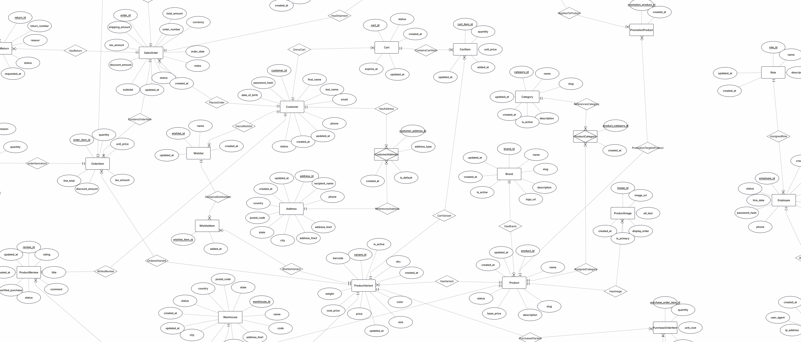
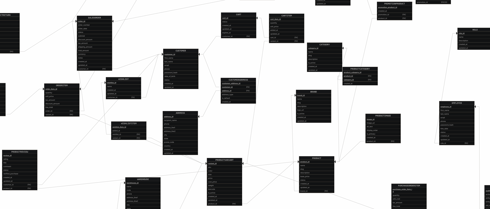

# Retail & E-Commerce Management Database

A complete relational database project designed for a modern retail and e-commerce platform.

This project demonstrates database design, normalization, SQL querying, analytics, stored procedures, functions, triggers, transactions, indexing, and business-oriented reporting using MySQL.

---

## Project Overview

The database models the core operations of a retail and e-commerce business, including:

- Customers and addresses
- Brands, products, categories, and variants
- Warehouses and inventory
- Suppliers and purchase orders
- Shopping carts and wishlists
- Sales orders and order items
- Payments and payment methods
- Shipments and shipment items
- Promotions and coupons
- Returns and refunds
- Product reviews
- Employees, roles, and audit logs

The schema contains **35 tables** and is designed to demonstrate both transactional and analytical SQL skills.

---

## Database Architecture

The project is divided into four main layers:

```text
Database Design
      ↓
Core SQL Implementation
      ↓
Query & Analytics Layer
      ↓
Advanced Database Programming
````

### Core database layer

Contains:

* Database creation
* Table definitions
* Primary keys
* Foreign keys
* Unique constraints
* CHECK constraints
* Indexes
* Sample data

### Query layer

Demonstrates:

* CRUD
* JOINs
* Subqueries
* CTEs
* Window functions
* Business analytics

### Advanced layer

Demonstrates:

* Views
* Stored procedures
* Stored functions
* Triggers
* Transactions
* Error handling
* Row locking
* Business workflow logic

---

## Conceptual ERD



The conceptual ERD represents the main business entities and relationships.

Major relationships include:

```text
Customer
 ├── CustomerAddress
 ├── Cart
 ├── Wishlist
 ├── SalesOrder
 └── ProductReview

Product
 ├── ProductVariant
 ├── ProductImage
 ├── ProductCategory
 ├── PromotionProduct
 └── ProductReview

ProductVariant
 ├── Inventory
 ├── CartItem
 ├── WishlistItem
 ├── OrderItem
 └── PurchaseOrderItem

SalesOrder
 ├── OrderItem
 ├── Payment
 ├── Shipment
 └── ProductReturn
```

---

## Relational Schema



The relational schema includes all tables, attributes, primary keys, foreign keys, and relationship mappings.

---

## Main Entities

The database contains the following 35 tables:

| #  | Table             |
| -- | ----------------- |
| 1  | Customer          |
| 2  | Address           |
| 3  | CustomerAddress   |
| 4  | Brand             |
| 5  | Category          |
| 6  | Product           |
| 7  | ProductCategory   |
| 8  | ProductVariant    |
| 9  | ProductImage      |
| 10 | Warehouse         |
| 11 | Inventory         |
| 12 | StockMovement     |
| 13 | Supplier          |
| 14 | PurchaseOrder     |
| 15 | PurchaseOrderItem |
| 16 | Cart              |
| 17 | CartItem          |
| 18 | Wishlist          |
| 19 | WishlistItem      |
| 20 | SalesOrder        |
| 21 | OrderItem         |
| 22 | PaymentMethod     |
| 23 | Payment           |
| 24 | Shipment          |
| 25 | ShipmentItem      |
| 26 | Promotion         |
| 27 | PromotionProduct  |
| 28 | Coupon            |
| 29 | ProductReturn     |
| 30 | ReturnItem        |
| 31 | Refund            |
| 32 | ProductReview     |
| 33 | Role              |
| 34 | Employee          |
| 35 | AuditLog          |

---

## Key Design Decisions

### Product and ProductVariant

`Product` stores general information.

`ProductVariant` stores sellable SKU-level information such as:

* SKU
* Color
* Size
* Selling price
* Cost price
* Weight
* Barcode

This allows one product to have multiple variations without duplicating the full product record.

---

### Inventory per Warehouse

Inventory is tracked using:

```text
ProductVariant + Warehouse
```

The schema enforces:

```sql
UNIQUE (variant_id, warehouse_id)
```

Available inventory is calculated as:

```text
quantity_on_hand - quantity_reserved
```

This supports reservation-based order processing and helps prevent overselling.

---

### Historical Pricing

`OrderItem.unit_price` stores the product price at the time of purchase.

This is intentionally separate from:

```text
ProductVariant.price
```

because current product prices may change while historical orders must remain accurate.

---

### Many-to-Many Relationships

Junction tables are used for many-to-many relationships.

Examples:

```text
Product
   ↓
ProductCategory
   ↓
Category
```

and:

```text
Promotion
   ↓
PromotionProduct
   ↓
Product
```

---

## SQL Features Demonstrated

### CRUD

Examples include:

```sql
SELECT
INSERT
UPDATE
DELETE
```

---

### JOINs

The project demonstrates:

```sql
INNER JOIN
LEFT JOIN
multi-table joins
anti-join patterns
many-to-many joins
```

Example:

```sql
SELECT
    p.name,
    b.name
FROM Product p
JOIN Brand b
    ON p.brand_id = b.brand_id;
```

---

### Subqueries

Includes:

* Scalar subqueries
* IN
* EXISTS
* NOT EXISTS
* Correlated subqueries
* Nested subqueries
* Derived tables

Example:

```sql
SELECT
    product_id,
    name,
    base_price
FROM Product
WHERE base_price > (
    SELECT AVG(base_price)
    FROM Product
);
```

---

### Common Table Expressions

Includes:

* Basic CTEs
* Aggregate CTEs
* Multiple CTEs
* Dependent CTEs
* Recursive CTE examples

Example:

```sql
WITH CustomerSpending AS (
    SELECT
        customer_id,
        SUM(total_amount) AS total_spent
    FROM SalesOrder
    GROUP BY customer_id
)

SELECT *
FROM CustomerSpending;
```

---

### Window Functions

The project demonstrates:

```sql
ROW_NUMBER()
RANK()
DENSE_RANK()
SUM() OVER()
AVG() OVER()
COUNT() OVER()
LAG()
LEAD()
```

Examples include:

* Customer order sequence
* Product revenue ranking
* Running revenue totals
* Previous order amount
* Month-over-month revenue growth
* Warehouse stock ranking

---

## Business Analytics

The project includes analytics for real retail questions.

Examples:

### Revenue Analysis

* Total revenue
* Revenue by order status
* Monthly revenue
* Cumulative revenue
* Month-over-month growth

### Customer Analysis

* Customer lifetime spending
* Top customers
* Repeat customers
* Customer order frequency
* Customer segmentation

### Product Analysis

* Units sold
* Product revenue
* Product revenue ranking
* Brand revenue
* Category revenue

### Profitability

* Estimated product cost
* Estimated gross profit
* Gross margin percentage

### Inventory

* Inventory valuation
* Warehouse stock value
* Available stock
* Reorder report
* Reservation rate

### Operations

* Supplier spend
* Payment success rate
* Shipment performance
* Return rate
* Refund totals
* Product rating performance

---

## Views

Reusable reporting views are defined under:

```text
advanced/01_views.sql
```

Examples include:

```text
vw_active_products
vw_product_variant_details
vw_inventory_availability
vw_low_stock
vw_customer_order_summary
vw_order_details
vw_order_payment_status
vw_order_shipment_status
vw_order_fulfillment
vw_product_sales_summary
vw_supplier_purchase_summary
vw_product_review_summary
vw_return_summary
vw_active_promotions
vw_monthly_sales_summary
vw_employee_audit_summary
```

Example:

```sql
SELECT *
FROM vw_customer_order_summary
ORDER BY total_spent DESC;
```

---

## Stored Procedures

Stored procedures implement reusable business operations.

Examples include:

```text
sp_add_customer
sp_update_customer_status
sp_update_product_status
sp_update_order_status
sp_get_customer_orders
sp_get_order_details
sp_adjust_inventory
sp_reserve_inventory
sp_release_inventory
sp_record_payment
sp_create_refund
sp_complete_refund
sp_add_product_review
```

Example:

```sql
CALL sp_get_customer_orders(1);
```

---

## Stored Functions

Functions implement reusable calculations.

Examples:

```text
fn_available_stock
fn_calculate_line_total
fn_percentage_discount
fn_calculate_discount
fn_gross_profit
fn_gross_margin_percentage
fn_customer_total_spending
fn_customer_order_count
fn_order_item_count
fn_order_total_quantity
fn_product_average_rating
fn_product_review_count
fn_delivery_days
fn_customer_segment
fn_coupon_remaining_uses
```

Example:

```sql
SELECT fn_available_stock(1);
```

---

## Triggers

Triggers are used for automatic database behavior.

Examples include:

* Status change audit logging
* Inventory validation
* Automatic payment timestamps
* Automatic return timestamps
* Refund timestamps
* Inventory change auditing

Example concept:

```text
UPDATE SalesOrder
        ↓
status changes
        ↓
trigger fires automatically
        ↓
AuditLog receives old and new values
```

---

## Transactions

Critical operations are implemented using transactions.

Examples include:

* Order placement
* Inventory reservation
* Order fulfillment
* Order cancellation
* Payment processing
* Refund processing
* Purchase receipt

The project uses:

```sql
START TRANSACTION
COMMIT
ROLLBACK
SELECT ... FOR UPDATE
EXIT HANDLER
RESIGNAL
```

Example transaction pattern:

```sql
START TRANSACTION;

SELECT ...
FOR UPDATE;

UPDATE ...;

COMMIT;
```

This helps prevent concurrency issues such as inventory overselling.

---

## ACID Concepts

The project demonstrates ACID transaction properties:

### Atomicity

All operations succeed or all are rolled back.

### Consistency

Database rules remain valid after each transaction.

### Isolation

Concurrent transactions are prevented from incorrectly interfering.

### Durability

Committed data remains permanently stored.

---

## Database Constraints

The schema uses several types of constraints.

### Primary Keys

Every main entity has a primary key.

### Foreign Keys

Foreign keys maintain referential integrity.

### Unique Constraints

Examples:

```text
Customer.email
ProductVariant.sku
SalesOrder.order_number
Coupon.code
ProductReview(customer_id, product_id)
Inventory(variant_id, warehouse_id)
```

### CHECK Constraints

Used for rules such as:

```text
rating between 1 and 5
reserved stock <= physical stock
valid statuses
valid discount percentages
positive quantities
valid date ranges
```

---

## Indexing

Indexes are added to improve commonly used filters and joins.

Examples include:

```text
Product.name
ProductVariant.price
SalesOrder(customer_id, order_date)
SalesOrder(status, order_date)
Payment(status, payment_date)
Shipment(status, shipped_at)
StockMovement(inventory_id, created_at)
ProductReview(product_id, status)
AuditLog(entity_name, entity_id)
```

Primary keys, foreign keys, and unique constraints are also automatically indexed by MySQL where appropriate.

---

## Normalization

The database primarily follows **Third Normal Form (3NF)**.

Normalization is used to reduce:

* Data duplication
* Update anomalies
* Insert anomalies
* Delete anomalies
* Data inconsistency

Some values are intentionally duplicated for historical accuracy.

Examples:

```text
OrderItem.unit_price
CartItem.unit_price
PurchaseOrderItem.unit_cost
SalesOrder.total_amount
OrderItem.line_total
```

This is controlled denormalization.

For more detail:

```text
docs/normalization.md
```

---

## Project Structure

```text
retail-ecommerce-management-db/
│
├── README.md
├── LICENSE
│
├── diagrams/
│   ├── conceptual_erd.png
│   └── relational_schema.png
│
├── database/
│   ├── 01_create_database.sql
│   ├── 02_create_tables.sql
│   ├── 03_constraints.sql
│   ├── 04_indexes.sql
│   └── 05_sample_data.sql
│
├── queries/
│   ├── 01_basic_crud.sql
│   ├── 02_joins.sql
│   ├── 03_subqueries.sql
│   ├── 04_ctes.sql
│   ├── 05_window_functions.sql
│   └── 06_business_analytics.sql
│
├── advanced/
│   ├── 01_views.sql
│   ├── 02_stored_procedures.sql
│   ├── 03_functions.sql
│   ├── 04_triggers.sql
│   └── 05_transactions.sql
│
└── docs/
    ├── business_rules.md
    ├── data_dictionary.md
    ├── normalization.md
    └── assumptions.md
```

---

## Installation

### Requirements

* MySQL 8.0 or later
* MySQL Workbench or another MySQL client

Window functions and CTEs require a modern MySQL version.

Check your version:

```sql
SELECT VERSION();
```

---

## Setup

Clone the repository:

```bash
git clone https://github.com/alphaxt/retail-ecommerce-management-db.git
```

Open MySQL Workbench.

Run the database scripts in this order:

```text
database/01_create_database.sql
database/02_create_tables.sql
database/03_constraints.sql
database/04_indexes.sql
database/05_sample_data.sql
```

Then run the advanced objects:

```text
advanced/01_views.sql
advanced/02_stored_procedures.sql
advanced/03_functions.sql
advanced/04_triggers.sql
advanced/05_transactions.sql
```

The query files can then be executed independently:

```text
queries/01_basic_crud.sql
queries/02_joins.sql
queries/03_subqueries.sql
queries/04_ctes.sql
queries/05_window_functions.sql
queries/06_business_analytics.sql
```

---

## Example Queries

### Top Products by Revenue

```sql
SELECT
    p.name AS product_name,
    SUM(oi.line_total) AS revenue
FROM OrderItem oi
JOIN ProductVariant pv
    ON oi.variant_id = pv.variant_id
JOIN Product p
    ON pv.product_id = p.product_id
GROUP BY
    p.product_id,
    p.name
ORDER BY revenue DESC;
```

---

### Customer Lifetime Spending

```sql
SELECT
    c.customer_id,
    CONCAT(
        c.first_name,
        ' ',
        c.last_name
    ) AS customer_name,
    COALESCE(
        SUM(so.total_amount),
        0
    ) AS total_spent
FROM Customer c
LEFT JOIN SalesOrder so
    ON c.customer_id = so.customer_id
GROUP BY
    c.customer_id,
    c.first_name,
    c.last_name
ORDER BY total_spent DESC;
```

---

### Running Revenue

```sql
SELECT
    order_number,
    order_date,
    total_amount,

    SUM(total_amount) OVER (
        ORDER BY order_date, order_id
        ROWS BETWEEN UNBOUNDED PRECEDING
        AND CURRENT ROW
    ) AS running_revenue

FROM SalesOrder;
```

---

### Previous Customer Order

```sql
SELECT
    customer_id,
    order_number,
    total_amount,

    LAG(total_amount) OVER (
        PARTITION BY customer_id
        ORDER BY order_date, order_id
    ) AS previous_order_amount

FROM SalesOrder;
```

---

## Documentation

Additional project documentation is available in:

### Business Rules

```text
docs/business_rules.md
```

Defines business behavior and integrity rules.

### Data Dictionary

```text
docs/data_dictionary.md
```

Documents all tables and major columns.

### Normalization

```text
docs/normalization.md
```

Explains 1NF, 2NF, 3NF, junction tables, and controlled denormalization.

### Assumptions

```text
docs/assumptions.md
```

Documents project scope and design assumptions.

---

## Skills Demonstrated

This project demonstrates practical knowledge of:

```text
Relational Database Design
ER Modeling
Normalization
Primary & Foreign Keys
Constraints
Indexes
CRUD
JOINs
Subqueries
CTEs
Window Functions
Business Analytics
Views
Stored Procedures
Stored Functions
Triggers
Transactions
Error Handling
Concurrency Control
Row Locking
Audit Logging
Inventory Management
SQL Reporting
```

---

## Business Domains Covered

The project models several connected business domains:

```text
Customer Management
Product Catalog
Warehouse Management
Inventory Control
Supplier Procurement
Shopping Cart
Wishlist
Order Management
Payment Processing
Shipping & Fulfillment
Promotions & Coupons
Returns & Refunds
Product Reviews
Employee Management
Audit Logging
Business Intelligence
```

---

## Future Improvements

Possible extensions include:

* Multi-level category hierarchy
* Product attribute-value system
* Multiple order-item warehouse allocation
* Coupon redemption history
* Tax rule engine
* Multi-currency exchange rates
* Customer loyalty points
* Supplier-product mapping
* Automated purchase reorder system
* Advanced role permissions
* Database event scheduler
* Partitioning for large audit/order tables
* Power BI dashboard integration
* Python analytics integration
* API/backend integration

---

## Technologies

* MySQL 8+
* SQL
* MySQL Workbench
* ERDPlus
* Git
* GitHub

---

## Author

Built as a portfolio database project to demonstrate practical SQL, relational database design, analytics, and database programming skills.

---

## License

See the `LICENSE` file for project licensing information.

